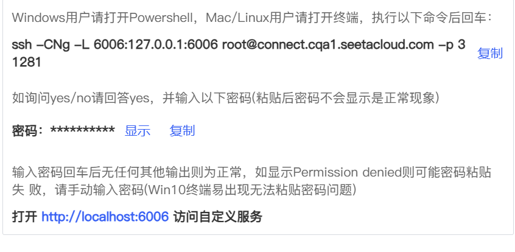
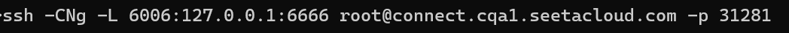
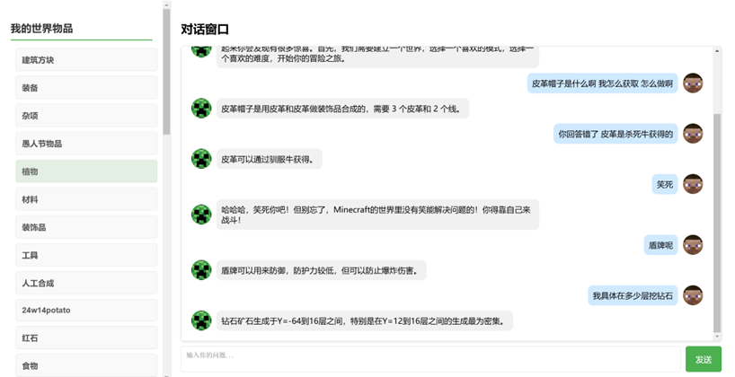

# Minecraft 聊天助手

本项目参考：https://github.com/KMnO4-zx/huanhuan-chat
项目主要基于Meta-Llama-3___1-8B-Instruct预训练集进行lora微调Minecraft数据集，得到一个Minecraft聊天助手。
并且支持网页交互，前端使用html+css+Javascript，后端使用python的Flask框架。项目主要是参考huanhuan-chat项目。
在此基础上进行改进，虽有诸多不足，后期应该会查漏补缺。
```markdown
 project/
│
├── dataset          
├ ├train           
│ ├── minecraft.json     
│ └── resource.json           
│ └── item_list.json
├── static/                 
│ ├── css/               
│ └── js/               
│
├── templates/             
│ └── index.html
├── app.py                  
├── model_download.py                 
├── train.py           
├── test.py           
└── README.md             
```

## Step 1: 环境准备

采用Autodl平台租用服务器，需要2块4090

基础环境如下：

```
----------------
ubuntu 22.04
python 3.12
cuda 12.1
pytorch 2.3.0
----------------
```

## Step 2: 数据准备

利用爬虫工具对minecraft论坛进行爬取。
注意：爬取需要参考robots.txt，切勿爬取敏感数据。

### Step 2.1:爬取一个示例网页

```shell
python minecraft_data_scraper/src/scraper_example.py
```

### Step 2.1:解析网页结构

```shell
python minecraft_data_scraper/src/parser_html.py
```

### Step 2.3:爬取论坛网页

```shell
python minecraft_data_scraper/src/scraper_resources.py
```

## Step 3: 模型下载

需要修改 cache_dir 路径

```shell
  python model_download.py
```

```shell
python train.py
```

> *注意：记得修改 `train.py` 中的数据集路径和模型路径哦~*

## Step 4: 模型测试

```shell
python test.py
```
## Step 5: 运行网页
> *我采用autodl租用服务器需要将服务器的端口映射到本地~*


```shell
python app.py
```



